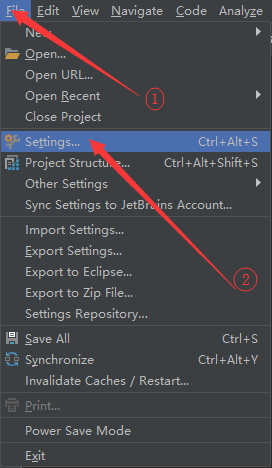
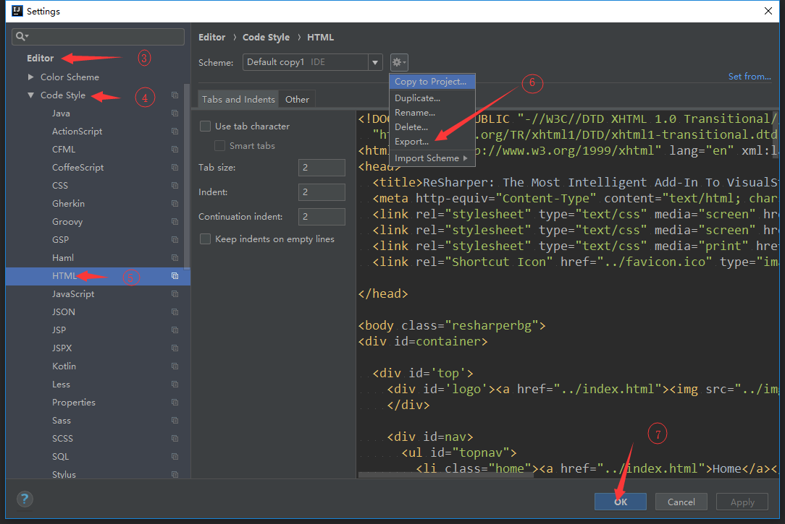
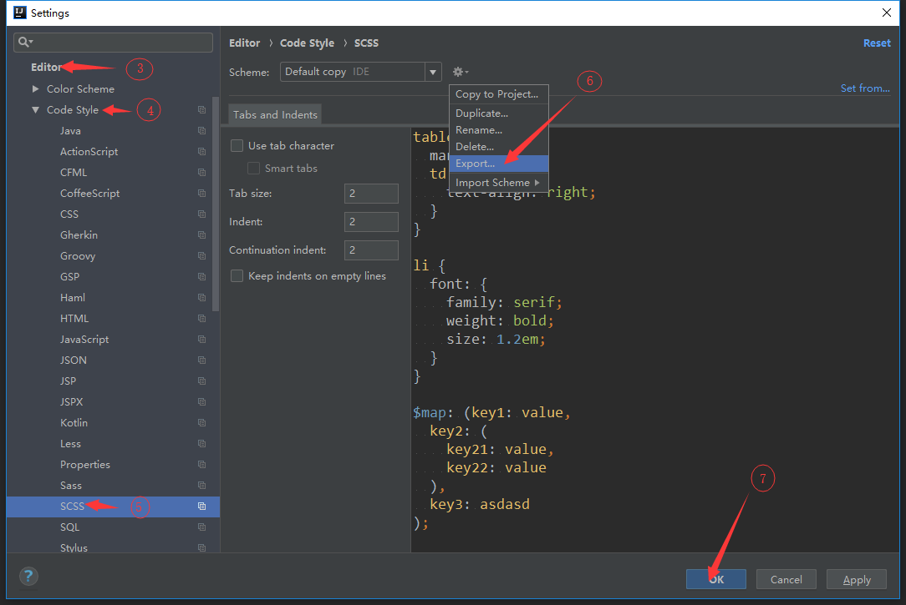
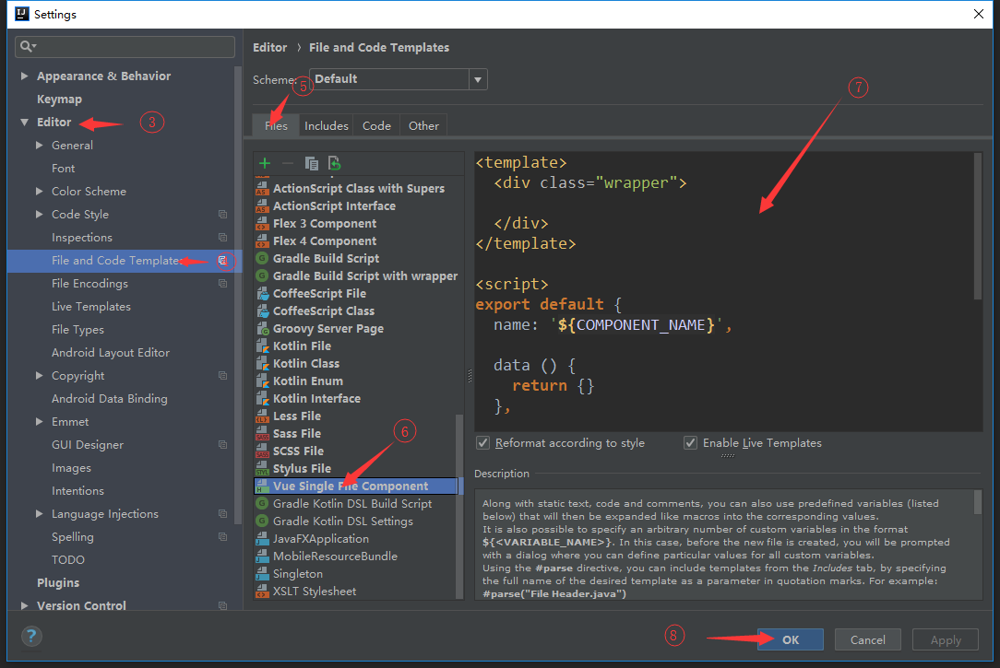

[1 安装sass插件](#1-安装sass插件)

[2 安装Vue插件](#2-安装Vue插件)

[3 HTML代码格式配置](#3-HTML代码格式配置)

[4 SCSS代码格式配置](#4-SCSS代码格式配置)

[5 Vue组件模板配置](#5-Vue组件模板配置)


## 说明：idea和Webstorm配置是一样的，所以没做区分。

# 1 安装sass插件

选择File > Settings > Plugins

* 搜索sass, 结果中有Sass Lint和Sass support都需要安装

如图所示：

<p>


</p>


# 2 安装Vue插件

选择File > Settings > Plugins

* 搜索Vue, 结果中有Vue.js

如图所示：

<p>
  
  
</p>


# 3 HTML代码格式配置

选择File > Settings > Editor > Code Style > HTML

如图所示：

<p>
  
  
</p>

<p>
  <a href="./Default.xml" target="_blank">配置文件下载</a>
</p>


# 4 SCSS代码格式配置

选择File > Settings > Editor > Code Style > SCSS

如图所示：

<p>
  
  
</p>

<p>
  <a href="./Default.xml" target="_blank">配置文件下载</a>
</p>


# 5 Vue组件模板配置

选择File > Settings > Editor > File and Code Templates

如图所示：

<p>
  
  
</p>

```html
<template>
  <div class="wrapper">

  </div>
</template>

<script>
export default {
  name: '${COMPONENT_NAME}',
  
  data () {
    return {}
  },
  
  mounted () {},
  
  methods: {}
}
</script>

<style scoped lang="scss">

</style>
```

