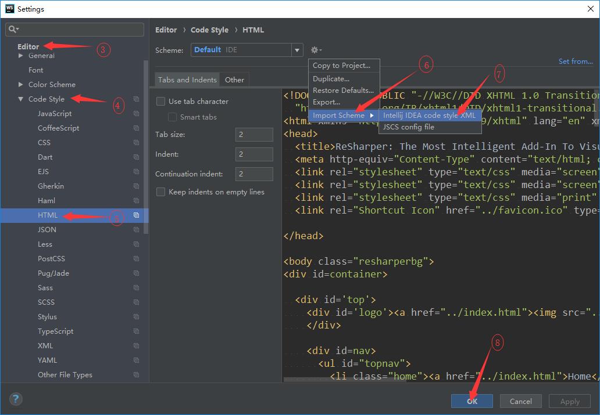
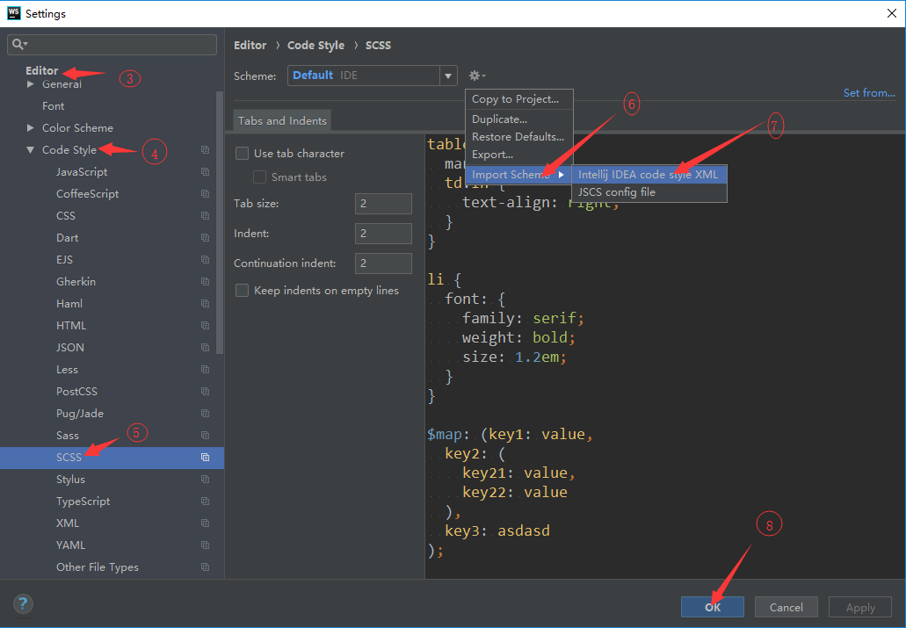

[1 安装sass插件](#1-安装sass插件)

[2 安装Vue插件](#2-安装Vue插件)

[3 HTML代码格式配置](#3-HTML代码格式配置)

[4 SCSS代码格式配置](#4-SCSS代码格式配置)

[5 Vue组件模板配置](#5-Vue组件模板配置)

## 说明：idea和Webstorm配置是一样的，所以没做区分。

# 1 安装sass插件

选择File > Settings > Plugins

* 搜索sass, 结果中有Sass Lint和Sass support都需要安装

如图所示：

  
  

# 2 安装Vue插件

选择File > Settings > Plugins

* 搜索Vue, 结果中有Vue.js

如图所示：

  
  

# 3 HTML代码格式配置

选择File > Settings > Editor > Code Style > HTML

如图所示：

  
  

  <a href="./Default.xml" target="_blank">配置文件下载</a>

# 4 SCSS代码格式配置

选择File > Settings > Editor > Code Style > SCSS

如图所示：

  
  

  <a href="./Default.xml" target="_blank">配置文件下载</a>

# 5 Vue组件模板配置

选择File > Settings > Editor > File and Code Templates

如图所示：

  
  

  <a href="./Vue component.vue" target="_blank">配置文件下载</a>

